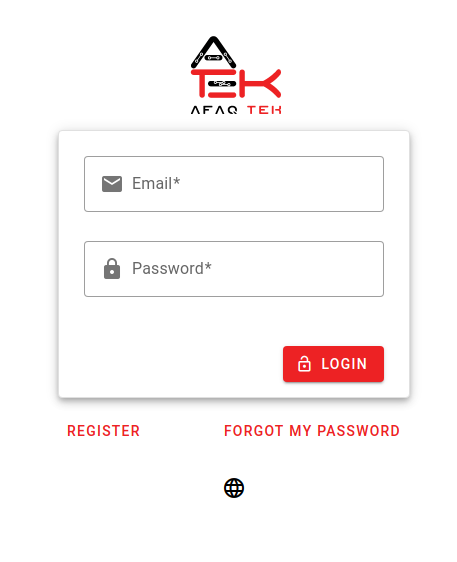
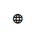
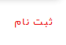
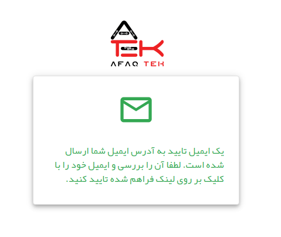
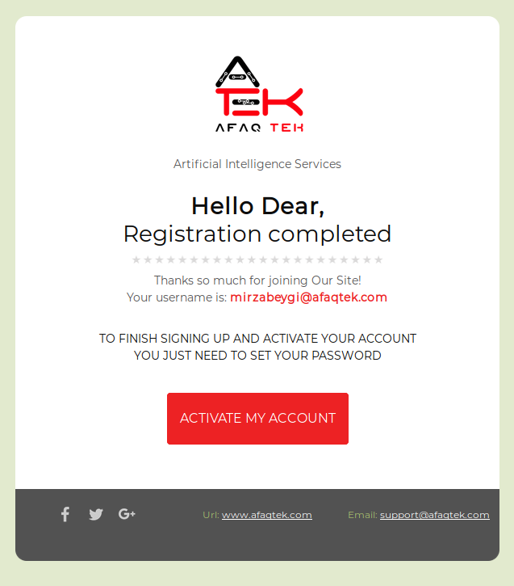

# شروع کار

شروع استفاده از پهما رایگان است. برای شروع باید در پلتفورم ثبت نام کنید. برای ثبت نام، مراحل زیر را انجام دهید.

* [اینجا](https://aib.afaqtek.com) را کلیک کنید تا به صفحه اصلی پهما منتقل شوید.

* بر روی آیکن کره زمین کلید کنید و از لیست نمایش داده شده زبان مورد نظر خود را انتخاب کنید تا بتوانید پهما را به زبان مورد نظر خود مشاهده نمایید.

* بر روی کلید ثبت نام ضربه بزنید.

* آدرس ایمیل، رمز عبور و تکرار رمز عبور مورد نظر خود را وارد کنید و در انتها بر روی کلید ثبت نام ضربه بزنید.

* در صورت مشاهده صفحه زیر، ثبت نام با موفقیت انجام شده است.

* باید به آدرس ایمیل خود مراجعه کنید و بر روی لینک فعال سازی کلید کنید تا حساب شما فعال شود. ممکن است ایمیل فعال سازی در پوشه اسپم شما قرار گرفته باشد.

* بعد از ثبت نام می‌توانید با نام کاربری و رمز عبور خود وارد سیستم شوید.

