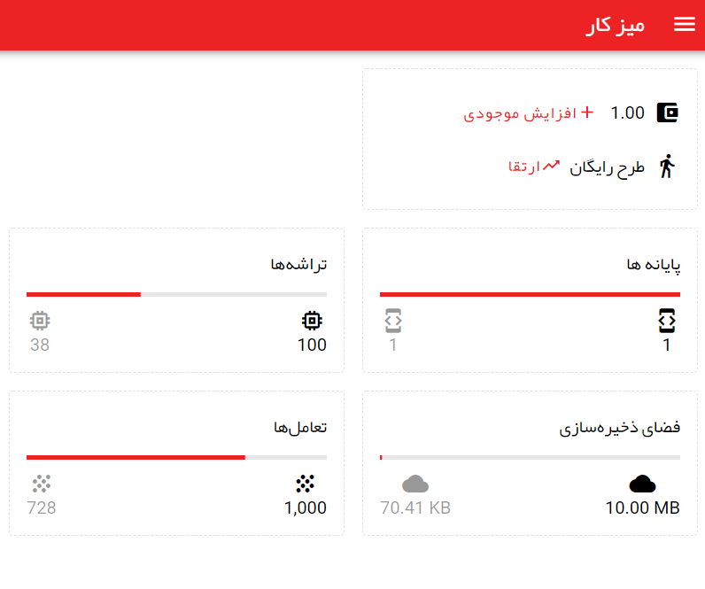
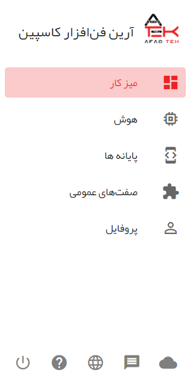
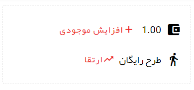
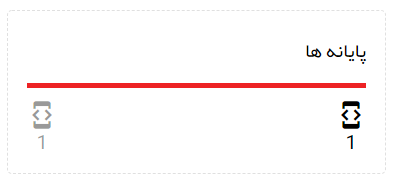
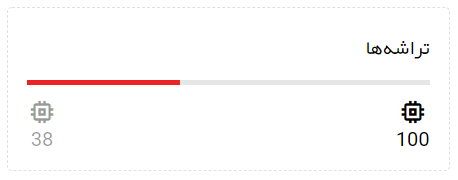
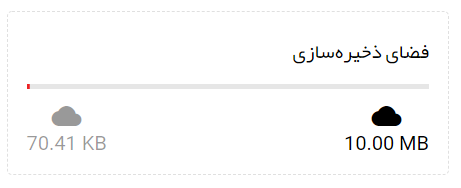
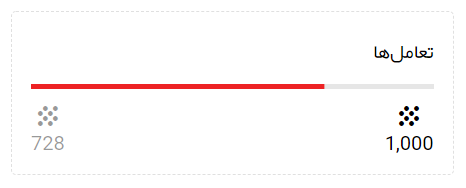

# معرفی پنل کاربری

## میز کار

بعد از ورود به پنل کاربری، اولین صفحه‌ای که مشاهده می‌کنید میز کار است.

در میز کار، بخش‌های مختلفی مشاهده می‌کنید. در نوار قرمز رنگ بالا در کنار عنوان صفحه، سه خط موازی مشاهده می‌کند که با کلیک روی آن منوی کشویی باز می‌شود.

## منوی کاربری

در تصویر زیر منوی کاربری برنامه را مشاهده می‌کند.

در بالای منوی صفحات مختلف برنامه را مشاهده می کنید که با زدن روی هر کدام وارد صفحه مربوطه می‌شوید.

در قسمت پایین منو هم یک سری آیکن مشاهده می‌کنید که هر کدام برای منظور خاصی طراحی شده‌اند.

### تغییر زبان برنامه

برای تغییر زبان منوی کاربری را باز کنید و سپس بر روی آیکن کره زمین کلیک کنید و زبان خود را تغییر دهید.

## اعتبار و پلان

در میز کار، باکس‌های مختلفی را مشاهده می‌کنید. یکی از این باکس‌ها، باکس اعتبار و پلان است.

در این بخش شما می‌توانید با زدن روی افزایش موجودی، موجودی خود را افزایش دهید. همچنین با زدن بر روی ارتقا، طرح خود را ارتقا دهید.

نحوه نمایش اعتبار در برنامه به صورت واحد اعتبار کیف پول است. مثلا در صورتی که هر واحد اعتبار معادل هزار تومان باشد، شما برای خرید ۱۰ واحد اعتبار مبلغ ۱۰ هزار تومان پرداخت می‌کنید.

## پایانه‌ها

باکس دیگری که در میز کار مشاهده می‌کنید، باکس پایانه‌هاست.

در بخش پایانه‌ها، شما تعداد پایانه‌‌هایی که مجاز به تعریف هستید و تعدادی که هم اکنون تعریف کرده‌اید را می‌توانید مشاهده کنید.
برای افزایش تعداد پایانه‌ها می‌توانید طرح خود را ارتقا دهید.

## تراشه‌ها

در این بخش تعداد تراشه‌هایی که می‌تونید ایجاد کنید و تعداد کنونی تراشه‌های خود را می‌بینید.

برای افزایش تعداد تراشه‌ها می‌توانید طرح خود را ارتقا دهید.

## فضای ذخیره سازی

در پهما می‌توانید فایل‌های خود را در یک فضای ذخیره سازی قرار دهید. در باکس فضای ذخیره سازی، مقدار فضایی را که در اختیار دارید و مقدار فضایی را که مصرف کرده‌اید می‌توانید مشاهده کنید.

در صورتی که به فضای بیشتری برای ذخیره سازی فایل‌های خود نیاز داشتید می‌توانید پلان خود را ارتقا دهید.

## تعامل‌ها

پر پهما شما برای هر ورودی که از کاربر دریافت می‌کنید یک یا چند عملیات تعریف می‌کنید. تعداد کل عملیاتی که در ارتباط با کاربران انجام می‌شود تحت عنوان تعامل‌ در پهما شناخته می‌شود.
در باکس تعامل‌ها در میز کار، تعداد تعامل‌های مجاز ماه جاری و تعداد تعامل‌های انجام شده تا کنون را مشاهده می‌کنید.

برای افزایش تعداد تعامل‌ها می‌توانید طرح خود را ارتقا دهید.
