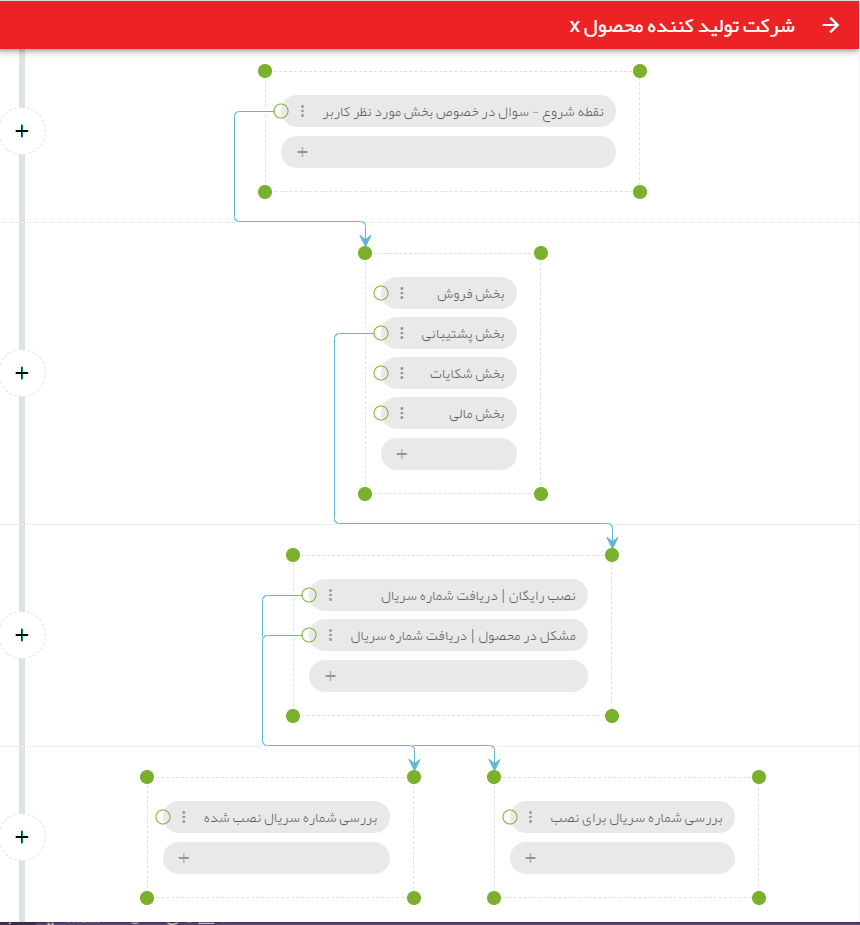
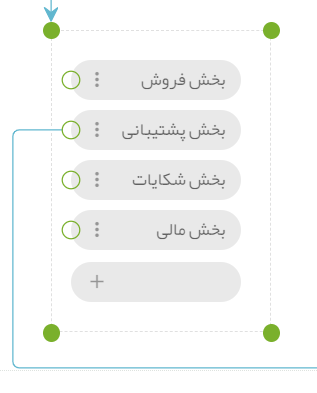

# کلیات

## گروه تراشه

در پهما شما ابتدا [گردش کاری](https://fa.wikipedia.org/wiki/%DA%AF%D8%B1%D8%AF%D8%B4_%DA%A9%D8%A7%D8%B1) مورد نظر خود را به صورت مجموعه‌ای از  [فلوچارت](https://fa.wikipedia.org/wiki/%D8%B1%D9%88%D9%86%D8%AF%D9%86%D9%85%D8%A7)‌ها پیاده سازی می‌کنید. مثلا فرض کنید که یک شرکت تولید کننده می‌خواهد به کاربران خود خدمات زیر را ارائه دهد:

1. ابتدا از کاربر سوال می‌کنیم که می‌خواهد با کدام بخش در ارتباط باشد. بخش‌های ممکن می‌تواند بخش **فروش**، بخش **پشتیبانی**، بخش **شکایات** و یا بخش **مالی** باشد.

2. حالا در صورتی که کاربر بخش پشتیبانی را انتخاب کرد، از اون سوال کنیم که آیا برای **نصب رایگان** محصول می‌خواهد وقت رزور کند یا اینکه **مشکلی در خصوص محصول نصب شده** دارد.

3. در صورتی که برای نصب رایگان درخواست داشت ابتدا شماره سریال محصول را دریافت می‌کنیم

4. در صورتی که شماره سریال معتبر بود چند زمان خالی به اون پیشنهاد می‌کنیم.

5. سپس زمان انتخاب شده را به نام او ثبت کرده و به بخش فنی شرکت اطلاع می‌دهیم.

6. در صورتی هم که کاربر در خصوص محصول نصب شده مشکلی داشت، ابتدا شماره سریال محصول را از اون می‌گیریم.

7. در صورتی که شماره سریال معتبر بود، از اون درخواست می‌کنیم که مشکل خود را ارسال کند.

8. مشکل ارسال شده را به بخش فنی ارسال می‌کنیم.

حال ما این _گردش کاری_ را با استفاده از ابزار‌های موجود در پهما پیاده سازی می‌کنیم. در تصویر زیر بخشی از گردش کاری فوق را که در پهما پیاده سازی شده است می‌توانید مشاهده کنید. همان طور که در تصویر زیر می‌بینید، گردش‌های کاری به صورت _فلوچارت_ در پهما قابل پیاده سازی اند که ما به آن‌ها **گروه تراشه** می‌گوییم.

گروه تراشه‌ها در برگیرنده مجموعه‌ای از تراشه‌ها هستند. در ادامه تراشه را معرفی می‌کنیم.

## تراشه

در پهما، کوچکترین واحد تصمیم گیری تراشه نام دارد. در تصویر زیر یک نمونه تراشه را مشاهده می‌کنید.

هر تراشه از دو بخش **شرایط** و **عملیات** تشکیل شده است که در ادامه به بررسی آن‌ها خواهیم پرداخت.

## بلوک تراشه

به مجموعه یک یا چند تراشه که در کنار هم قرار دارند یک بلوک تراشه گفته می‌شود. در تصویر زیر یک نمونه بلوک تراشه نمایش داده شده است.

## هوش

شما می‌توانید برای هر منظور خاص یک گروه تراشه طراحی کنید و هر گروه تراشه را به یک یا چند پایانه متصل کنید. هر پایانه‌ای که به گروه تراشه متصل می‌شود عملکرد‌های آن گروه تراشه را در خود فعال می‌کند.

مجموعه‌ای از گروه تراشه‌های متصل به یک پایانه، هوش آن پایانه را تشکیل می‌دهند.

## پایانه

هر گروه تراشه‌ای را که طراحی می‌کنید، باید به نحوی با کاربران در ارتباط باشد. پهما برای این کار مفهومی به نام پایانه را در نظر گرفته است. شما می‌توانید پیام رسان‌هایی را که پهما پشتیبانی می‌کند به عنوان پایانه در نظر بگیرید.
امکان معرفی یک یا چند پایانه وجود دارد و شما می‌توانید گروه تراشه‌های خود را به صورت همزمان به چندین پایانه متصل کنید.
