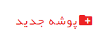
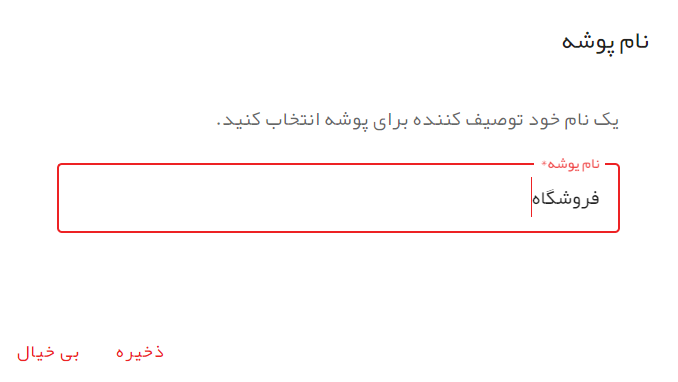
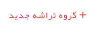
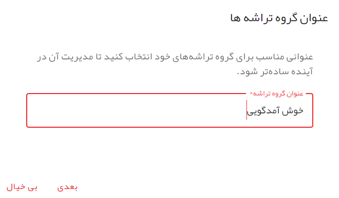
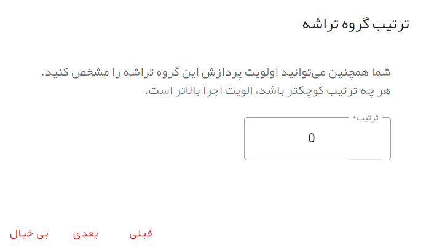
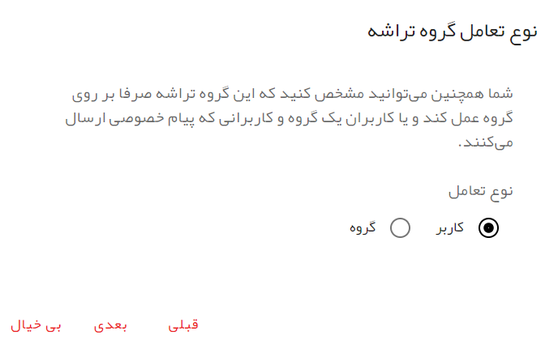
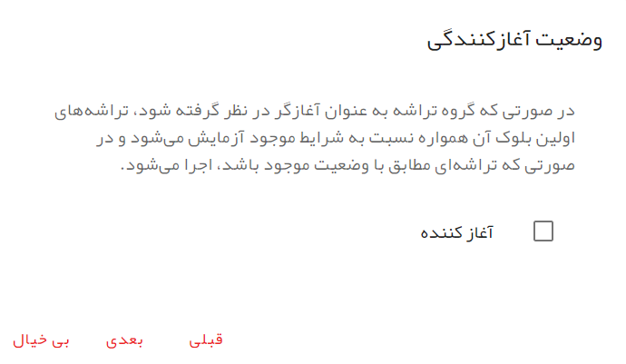
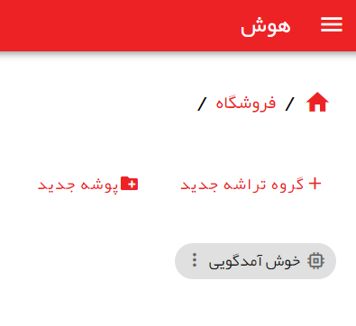

# گروه تراشه

اولین قدم در ایجاد هوش برای ربات، ایجاد گروه تراشه است. برای این منظور منوی کشویی را با زدن بر روی سه خط موازی در سمت راست نوار قرمز رنگ بالای صفحه، باز کنید و سپس وارد صفحه هوش شوید.

## پوشه جدید

با زدن روی **پوشه جدید** یک پوشه جدید برای گروه تراشه‌های خود ایجاد کنید. هر چند که گروه تراشه‌های خود را می‌توانید خارج از پوشه‌ نیز ایجاد کنید اما سازماندهی گروه تراشه‌ها در قالب پوشه کمک کننده است.

در پنچره ظاهر شده یک نام برای پوشه جدید وارد کرده و سپس بر روی ذخیره بزنید.

بعد از اینکه پوشه جدید را ایجاد کردید با کلید بر روی آن وارد پوشه شوید. 

## مسیریابی

در هر لظه می‌توانید با نگاه کردن به بخش مسیریابی، مسیری را که هم اکنون داخل آن هستید مشاهده کنید.

با زدن بر روی آیکن خانه می‌توانید به صفحه اول هوش منتقل شوید و همچنین  با زدن بر روی نام هر یک پوشه‌های نمایش داده شده در مسیریابی می‌توانید وارد آن پوشه شوید.

## گروه تراشه جدید

در حالی که در پوشه مورد نظر خود هستید با زدن روی **گروه تراشه جدید** اقدام به ایجاد گروه تراشه‌ای جدید نمایید.

### عنوان گروه تراشه

در پنجره **عنوان گروه تراشه** یک عنوان برای گروه تراشه خود وارد کنید و بر روی کلید **بعدی** بزنید.

### ترتیب گروه تراشه

در پنجره بعدی که پنجره **ترتیب گروه تراشه** است شما می‌توانید یک ترتیب برای گروه تراشه وارد کنید.
لزوم استفاده از ترتیب به این دلیل است که برنامه اینگونه عمل می‌کند که بعد از دریافت یک ورودی از پایانه، از بین گروه تراشه‌های متثل به پایانه، ابتدا گروه تراشه‌هایی که شماره ترتیب آن‌ها پایین تر است بررسی می‌شود و در صورتی که شرایط یکی از تراشه‌های موجود در سطح اول آن‌ها باعث ایجاد اتصال شود، برنامه گروه تراشه‌های بعدی را دیگر بررسی نخواهد کرد.
بنابراین همیشه گروه تراشه‌هایی را که می‌خواهید در ابتدا بررسی شود، در ترتیب پایین تر قرار دهید.

### نوع تعامل گروه تراشه

بعد از مشخص کردن ترتیب گروه تراشه، پنجره بعدی **نوع تعامل گروه تراشه** است.

در حال حاضر دو نوع تعامل برای گروه تراشه ممکن است. نوع تعامل **کاربر** و نوع تعامل **گروه**.

با انتخاب نوع تعامل **کاربر**، گروه تراشه آمادگی تعامل با _کاربران خصوصی_ و همچنین _کاربران گروه_ را خواهد داشت اما با انتخاب نوع تعامل **گروه**، گروه تراشه برای انجام عملیات بر روی _گروه_ آماده خواهد شد به طوری که گروه تراشه به کاربران خصوصی پاسخ نمی‌دهد و در گروه نیز تنها موجودیتی به اسم گروه را می‌شناسد هرچند که پیام هر یک از اعضای گروه را رصد می‌کند اما آن‌ها را به صورت مجزا به رسمیت نمی‌شناسد.

فعلا در این بخش نوع تعامل کاربر را انتخاب کرده و بر روی کلید بعدی بزنید.

### وضعیت آغازکنندگی

برنامه به این صورت عمل می‌کند که زمانی که یک ورودی از طرف کاربر به یک پایانه می‌رسد، در صورتی که برنامه در ارتباط با آن کاربر در _حالت اولیه_ قرار داشته باشد، ایتدا تمام گروه تراشه‌های متصل به آن پایانه با ترتیب مشخص شده برای آن‌ها یک به یک بررسی می‌شود.

نحوه بررسی به این صورت است که ابتدا گروه تراشه اول انتخاب می‌شود و تمام تراشه‌های موجود در بلوک اول گروه تراشه از بالا به پایین بررسی می‌شود. در صورتی که یک اتصال اتفاق بیافتد، برنامه وارد تراشه شده و مجموعه عملیات تعریف شده در آن را به ترتیب اجرا می‌کند و تراشه‌ها و گروه تراشه‌های دیگر را بررسی نخواهد کرد.

بعد از انجام عملیات، برنامه بررسی می‌کند که اگر تراشه به بلوک تراشه‌ی دیگری در گروه تراشه متصل باشد، به آنجا هدایت می‌شود و دیگر برنامه در حالت اولیه قرار ندارد.

ورودی بعدی کاربر، تنها تراشه‌های موجود در بلوکی را بررسی خواهد کرد که برنامه در مرحله قبل به آن‌جا رفته است و این روال تا زمانی ادامه پیدا می‌کند که تراشه‌ای پیدا شود که به بلوکی متصل نیست. در این صورت برنامه دوباره به حالت اولیه منتقل می‌شود.

پس اگر برنامه در حالت اولیه نباشد، بلوک‌های اول گروه تراشه‌های دیگر بررسی نخواهند شد. حالا ممکن است شرایطی به وجود بیاید که شما لازم دارید که بلوک اول یک یا چند گروه تراشه، صرف نظر از اینکه برنامه در حالت اولیه قرار دارد یا در گروه تراشه‌ی دیگری است، همواره بررسی شود. در این حالت با زدن تیک **آغازکننده** از برنامه می‌خواهید که تراشه‌های بلوک اول این گروه تراشه همواره بررسی شوند. 

گروه تراشه‌هایی که **آغازکننده** اند همیشه بدون در در نظر گرفتن حالت برنامه، اول از همه بررسی می‌شوند. در بین گروه تراشه‌های آغازکننده هم ترتیب گروه تراشه مشخص کننده ترتیب بررسی است.

### اتصال به پایانه‌ها

گروه تراشه‌ای که تعریف می‌کنید، برای ارتباط با کاربران لازم دارد که از یک پیام رسان استفاده کند. شما برای معرفی پیام رسان مورد نظر خود لازم است که آن را در بخش پایانه‌ها معرفی کنید. برای اطلاع بیشتر در این خصوص می‌توانید بخش پایانه‌ها را مشاهده کنید.

در این بخش می‌توانید گروه تراشه خود را به یک یا چند پایانه متصل کنید و در نهایت بر روی کلید ذخیره ضربه بزنید تا گروه تراشه شما ایجاد شود.

### ایجاد شدن گروه تراشه جدید

با زدن ذخیره در مرحله قبل، گروه تراشه شما ایجاد و صفحه قابل مشاهده خواهد بود.

شما حالا آماده اید تا فلوجارت مورد نظر خود را این گروه تراشه ایجاد نمایید. برای این منظور کافی است روی گروه تراشه کلید کنید تا وارد آن شوید.

همچنین برای انجام عملیات بر روی گروه تراشه می‌توانید بر روی سه نقطه واقع در سمت چپ گروه تراشه کلیک کنید تا منوی عملیات برای روی گروه تراشه باز شود و سپس می‌توانید عملیات مورد نظر خود را انتخاب کنید.
