# تراشه

تراشه کوچکترین واحد هوش در پهماست که از دو قسمت اصلی تشکیل شده است:

قسمت **شرط** که مشخص کننده وضعیتی است که باعث فعال شدن تراشه می‌شود. در این قسمت شما می‌توانید شرایط متنوعی تعریف کنید. مثلا در ساده ترین حالت مشخص می‌کنید که متن پیام ارسال شده توسط کاربر شامل یک سری کلمات باشد.

قسمت **عملیات**، بخشی است که در آن یک یا چند عملیات تعریف می‌کنید که در صورت فعال شدن تراشه انجام شود.

## ایجاد تراشه

بعد از ایجاد گروه تراشه، در صورتی که روی گروه تراشه کلیک کنید وارد آن خواهید شد. در ابتدا که گروه تراشه را تازه ایجاد کرده‌اید تنها یک خط عمودی در سمت چپ مواجه خواهید شد که یک آیکن به علاوه در وسط آن قابل مشاهده است.

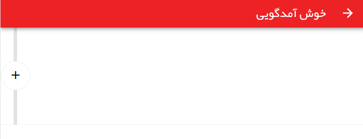

برای ایجاد تراشه جدید باید بر روی آیکن به علاوه که در سمت چپ قرار دارد ضربه بزنید تا اولین تراشه ایجاد شود.

## عنوان تراشه

در ابتدا یک عنوان برای تراشه خود انتخاب کنید.

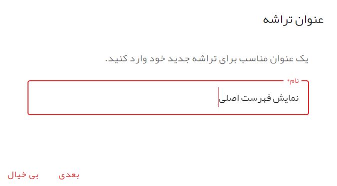

## انتخاب تراشه قبلی

در پهما شما می‌توانید تراشه‌ها را به یک دیگر متصل کنید. در این صورت اگر تراشه فعال شده عملیات تعریف شده برای آن با موفقیت انجام شود، برنامه به بلوکی که تراشه به آن متصل است منتقل می‌شود. در این صورت ورودی بعدی کاربر باعث سنجش تراشه‌های موجود در این بلوک خواهد شد و گروه تراشه‌های دیگر بررسی نخواهند شد و می‌گوییم که برنامه دیگر در حالت اولیه قرار ندارد.

**استثنا**: گروه تراشه‌هایی که آن‌ها را به عنوان آغازکننده انتخاب کرده‌اید از این موضوع مستثنا هستند و تراشه‌های موجود در بلوک اول آن‌ها همواره بررسی می‌شود.

با این توضیح در پنجره **انتخاب تراشه قبلی** شما می‌توانید تراشه‌ای را در یک سطح بالاتر انتخاب کنید که این تراشه باید به آن متصل شود. 

با توجه به اینکه فعلا ما در سطح اول قرار داریم و سطح دیگری وجود ندارد، نمی‌توانیم تراشه‌ای را انتخاب کنیم و صرفا باید بعدی را بزنیم.

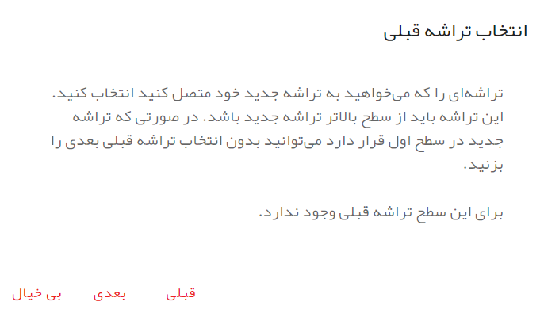

## شرط تراشه

یکی از مهمترین بخش‌های معرفی تراشه، بخش شرط تراشه است. شما در این مرحله مشخص می‌کنید که در چه شرایطی تراشه فعال می‌شود.

امکان معرفی شرایط متنوعی در این بخش وجود دارد که به مرور با همه آن‌ها آشنا خواهید شد. فعلا برای سادگی کار یک شرط را مشخص می‌کنیم. در صورتی که نوع پیام متنی باشد و متن پیام برابر با /start باشد.

برای این کار دو شرط باید تعریف شود. برای معرفی شرط اول که مشخص کننده نوع پیام ارسالی توسط کاربر است در سمت راست منو را باز کنید و سپس پیام را باز کنید و آن‌گاه نوع پیام را انتخاب کنید.

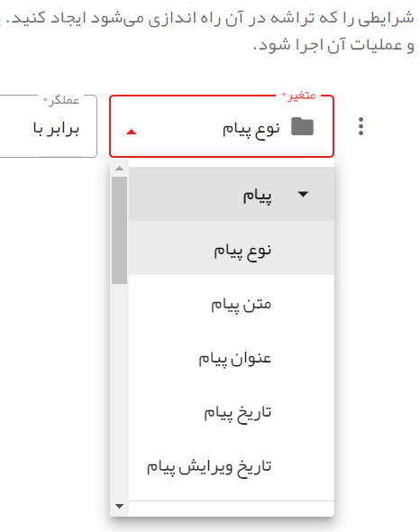

سپس در منوی وسط عملگر شرط را انتخاب کنید. ما می‌خواهیم نوع پیام برابر با پیام متنی باشد، پس باید عملگر برابر با را برابر با را انتخاب کنیم.

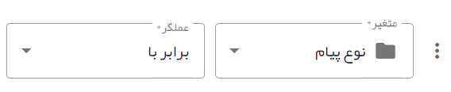

در نهایت برای مشخص کردن مقدار سوم باید کلمه مناسب را وارد کنیم. دقت کنید که کلمه باید به صورت انگلیسی وارد شود. برای راحتی کار می‌توانید روی آیکن پوشه سفید کلیک کنید تا ورودی تبدیل به منوی انتخاب شود و از لیست ارایه شده مقدار مناسب را انتخاب کنید. برای برگشت به حالت نوشتاری قبل هم می‌توانید یا یک مقدار از فهرست را انتخاب کنید یا روی آیکن پوشه مشکلی رنگ کلیک کنید.

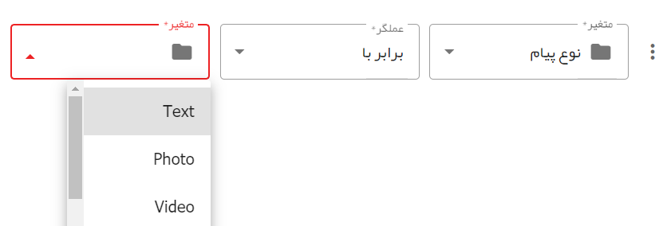

حالا باید شرط دوم را مشخص کنیم. برای مشخص کردن شرط دوم باید روی سه نقطه موجود در سمت راست شرط تعریف شده کلید کنیم تا منو باز شود و  سپس بر روی شرط جدید ضربه می‌زنیم.

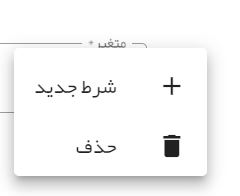

با این کار محیط معرفی شرط برای تراشه به صورت زیر تبدیل خواهد شد.

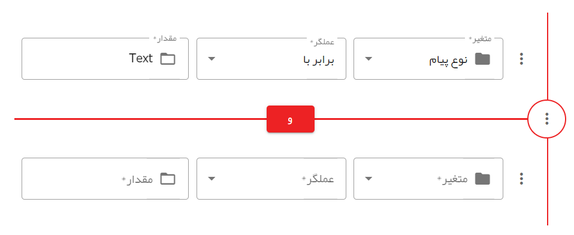

یک مستطیل قرمز رنگ در وسط می‌بینید که این مستطیل رابطه بین دو شرط بالا و پایین خود را مشخص می‌کند. مقادیر ممکن برای این مستطیل می‌تواند **و** و یا **یا** باشد. شما با کلیک بر روی این مستطیل می‌توانید بین **و** و **یا** عوض کنید.

ارتباط **و** ‌بیان کننده این است که هم شرط بالا و هم شرط پایین باید همزمان برقرار و درست باشند.

ارتباط **یا** اما بیان کننده این است که فقط درست بودن یکی از دو شرط کافی است و یا شرط بالا و یا شرط پایین اگر درست باشد تراشه فعال می‌شود.

شرط لازم برای ما در اینجا **و** است پس در همین حالت آن را نگه می داریم و باقی متغیر‌ها را به صورت زیر تعریف می‌کنیم:

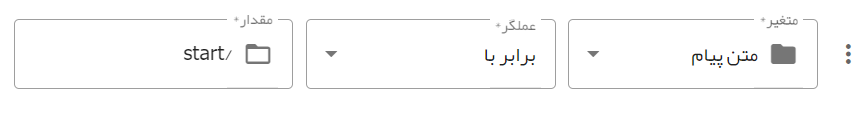

به این ترتیب ما در حال معرفی تراشه‌ای هستیم که نسبت به پیام‌های متنی که متن پیام‌ آن‌ها برابر با /start است حساس هستند.

## عملیات تراشه

بخش پایانی ایجاد تراشه، معرفی عملیاتی است که با فعال شدن تراشه باید انجام شود. در این بخش می‌توانید یک یا چند عملیات معرفی کنید و با دامنه وسیعی از عملیات قابل انجام روبرو هستید که به مرور آن‌ها را بررسی خواهیم کرد. فعلا برای شروع تنها یک عملیات تعریف می‌کنیم. عملیات ارسال پیام متنی به کاربری که /start ربات را زده است.

برای این کار بر روی کلید عملیات جدید ضربه بزنید.

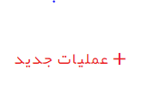

یک عملیات جدید ایجاد می‌شود. در بخش نوع عملیات به صورت پیش فرض **ارسال متن**‌انتخاب شده است که همان چیزی است که ما می‌خواهیم. در این‌جا شما می‌توانید مثلا ارسال تصویر یا ویدیو را انتخاب کنید و یا عملیات مرتبط با ذخیره سازی در دیتابیس را انتخاب کنید که بعدا با آن‌ها آشنا خواهیم شد.

فعلا گزینه‌های دیگر این عملیات را نیز نادیده می‌گیریم. فعلا تنها کاری که باید انجام دهیم این است که بر روی باکسی که نوشته است **متنی وارد کنید ...** کلیک می‌کنیم تا ویرایشگر باز شود و متن مورد نظر خود را وارد می‌کنیم. مثلا متن زیر را وارد کنید و سپس ذخیره را بزنید:

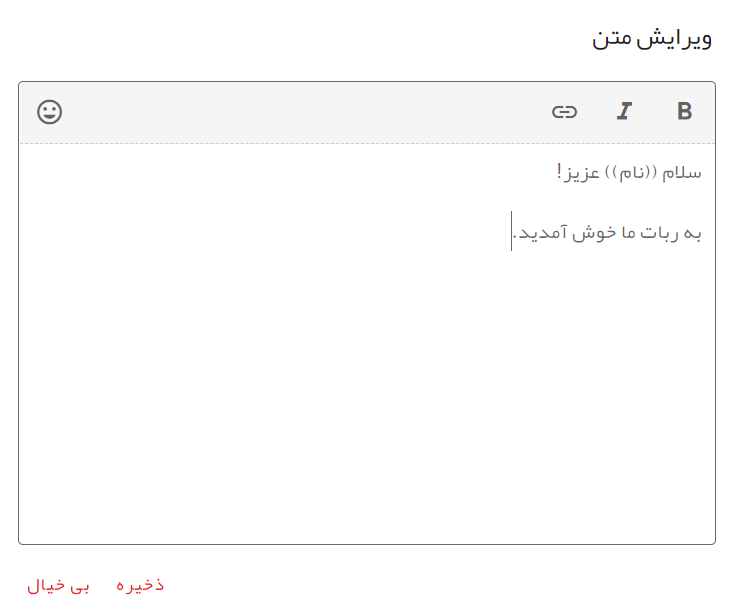

شاید متوجه **((نام))** در متن شده باشید. پهما دارای یک سیستم پردازش متن است که قدرت خاصی به ربات شما می‌دهد. در پهما می‌توانید متغیر‌های از پیش تعریف شده و متغیرهایی که خودتان تعریف می‌کنید را در متن بین دو پردانتز محصور کنید تا برنامه آن‌ها را با متن مورد نظر شما جایگزین کند. در اینجا ما از متغیر از پیش تعریف شده **نام** استفاده کرده‌ایم که نام کاربر را جایگزین می‌کند.

## ذخیره تراشه

در نهایت بر روی کلید ذخیره ضربه بزنید تا تراشه شما ذخیره شود.
