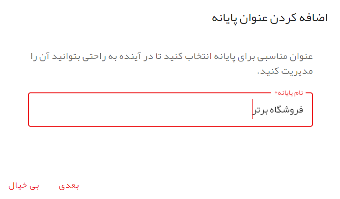
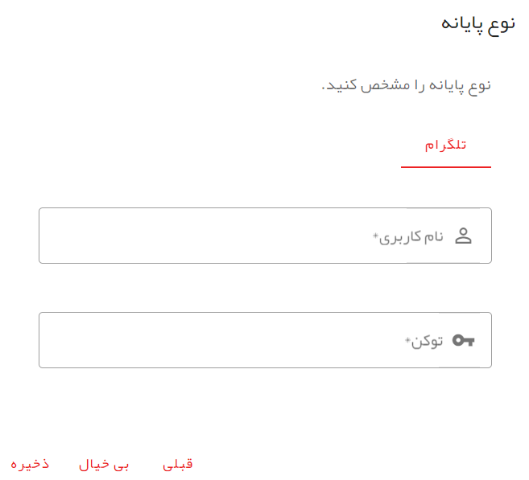

# ایجاد پایانه

## پایانه چیست؟

شما در بخش هوش، اقدام به معرفی گروه تراشه‌ها و تراشه‌های خود می‌کنید.این تراشه‌ها برای فعال شدن نیاز به ورودی دارند و همچنین باید عملیات خود را در یک خروجی انجام دهند. 

برای ارتباط تراشه‌ها با محیط بیرون در پهما مفهومی به نام **پایانه**‌ طراحی شده است. هر پایانه با مفهومی به نام ربات در یکی از پیام رسان‌هایی که پهما پشتیبانی می‌کند در ارتباط است. به این ترتیب می‌توانیم هر پایانه را یک ربات در نظر بگیریم.

شما می‌توانید هوشی را که در قالب گروه تراشه‌ها ایجاد کرده‌اید به یک یا چند پایانه به صورت همزمان متصل کنید. هر گروه تراشه قابلیت اتصال به یک یا چند پایانه را دارد.

## پایانه جدید

برای ایجاد پایانه جدید منوی کشویی برنامه را باز کنید و سپس به صفحه پایانه‌ها بروید. سپس در این صفحه بر روی کلید پایانه جدید ضربه بزنید.

## انتخاب نام

در پنجره **اضافه کردن عنوان پایانه** یک عنوان مناسب برای پایانه خود انتخاب کنید.

## انتخاب پیام رسان

در مرحله بعد باید از بین پیام رسان‌هایی که پهما پشتیبانی می‌کند یکی را انتخاب و اطلاعات مورد نیاز را وارد کرده و در نهایت بر روی کلید ذخیره ضربه بزنید.

پایانه شما در این صورت ایجاد خواهد شد و در بخش پایانه‌ها قابل مشاهده است.
